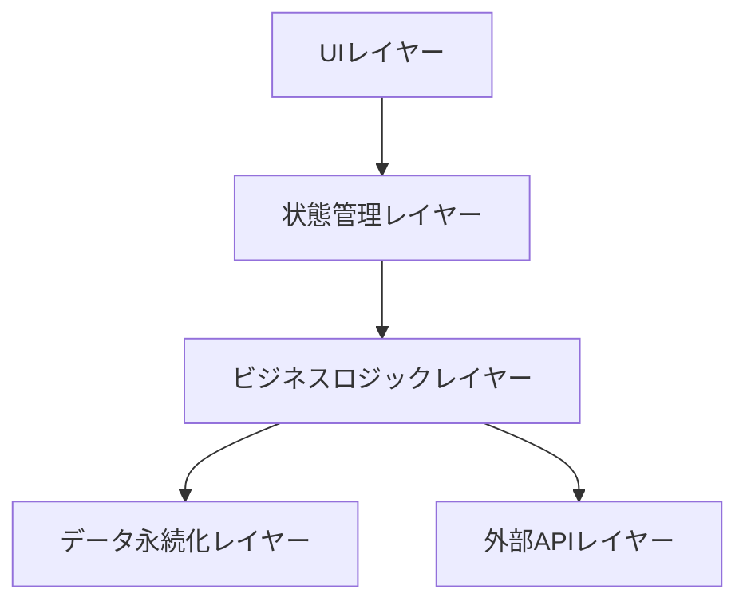
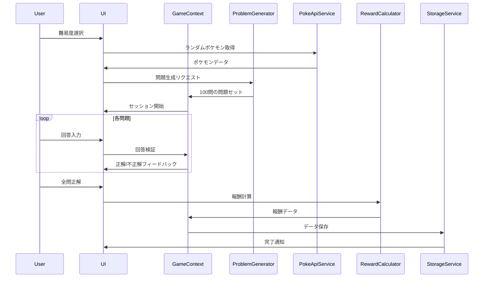

# 設計ドキュメント

## 概要

ポケモン100マス計算チャレンジは、Reactベースのシングルページアプリケーション（SPA）として実装します。ローカルストレージを使用してユーザーデータを永続化し、子供が直感的に操作できるシンプルなUIを提供します。

### 技術スタック
- **フロントエンド**: React 18+ with TypeScript
- **状態管理**: React Context API + useReducer
- **UIコンポーネント**: shadcn/ui
- **スタイリング**: Tailwind CSS
- **外部API**: PokeAPI (https://pokeapi.co/)
- **データ永続化**: LocalStorage
- **ビルドツール**: Vite
- **開発手法**: TDD (Test-Driven Development) with BDD principles

## アーキテクチャ

### システム構成



### レイヤー構成

1. **UIレイヤー**: Reactコンポーネント（プレゼンテーション）
2. **状態管理レイヤー**: Context API + Reducers
3. **ビジネスロジックレイヤー**: サービスクラス（計算問題生成、報酬計算、ガチャロジック）
4. **データ永続化レイヤー**: LocalStorageラッパー
5. **外部APIレイヤー**: PokeAPI クライアント

## コンポーネントとインターフェース

### 主要コンポーネント構成

```
src/
├── components/
│   ├── GameBoard/
│   │   ├── GameBoard.tsx          # 100マスグリッドのメインコンポーネント
│   │   ├── AnswerCell.tsx          # 回答セル（タップ可能）
│   │   ├── HeaderCell.tsx          # ヘッダー行・列のセル
│   │   ├── HiddenImage.tsx         # 背景のポケモン画像
│   │   └── CalculatorModal.tsx     # 電卓UI（モーダル/ボトムシート）
│   ├── DifficultySelector/
│   │   └── DifficultySelector.tsx  # 難易度選択画面
│   ├── Timer/
│   │   └── Timer.tsx               # カウントダウンタイマー
│   ├── Collection/
│   │   ├── CollectionView.tsx      # コレクション一覧
│   │   └── PokemonCard.tsx         # ポケモンカード表示
│   ├── Gacha/
│   │   └── GachaView.tsx           # ガチャ画面
│   ├── Stats/
│   │   └── StatsView.tsx           # 統計画面
│   └── Rewards/
│       └── RewardModal.tsx         # 報酬表示モーダル
├── contexts/
│   ├── GameContext.tsx             # ゲーム状態管理
│   └── UserContext.tsx             # ユーザーデータ管理
├── services/
│   ├── ProblemGenerator.ts         # 計算問題生成
│   ├── RewardCalculator.ts         # 報酬計算ロジック
│   ├── GachaService.ts             # ガチャロジック
│   ├── StorageService.ts           # LocalStorage操作
│   └── PokeApiService.ts           # PokeAPI クライアント
├── types/
│   └── index.ts                    # TypeScript型定義
└── utils/
    └── pokemonRarity.ts            # ポケモンのレア度判定ロジック
```

### コンポーネント詳細

#### GameBoard
- オリジナルの100マス計算形式のグリッドを表示
- 最上部にヘッダー行（10個の数字）を配置
- 最左部にヘッダー列（10個の数字）を配置
- 10×10の回答セルを配置
- 各回答セルの状態（未回答/正解/不正解）を管理
- 背景のポケモン画像を段階的に表示

#### HeaderCell
- ヘッダー行・列に表示する数字セル
- 読み取り専用（タップ不可）
- 視覚的に回答セルと区別できるスタイル

#### AnswerCell
- 回答を入力するセル
- タップ時に電卓UIを表示
- 正解/不正解の視覚的フィードバック
- 正解時のアニメーション効果
- 未回答時は空白、正解時は入力した数字を表示

#### CalculatorModal
- 電卓風のUIをモーダルまたはボトムシートで表示
- 0-9の数字ボタン（3×4グリッド）
- 削除ボタン（バックスペース）
- 決定ボタン（確定）
- キャンセルボタン（閉じる）
- 入力中の数字を表示するディスプレイエリア
- 現在選択中のセルの位置情報を表示
- タッチフレンドリーな大きなボタン（最低44x44px）

#### Timer
- 残り時間のカウントダウン表示
- 時間切れ時のイベント発火
- 視覚的な警告（残り時間が少ない時）

#### CollectionView
- 獲得済みポケモンの一覧表示
- 未獲得ポケモンのシルエット表示
- レア度別のフィルタリング機能
- コレクション完成度の表示

#### GachaView
- ガチャ実行ボタン
- 必要ポイントの表示
- ガチャアニメーション
- 獲得ポケモンの演出

#### StatsView
- ユーザーの統計情報を表示する画面
- サマリーカード: 現在のポイント、合計プレイ回数、進捗率を表示
- レベル別統計テーブル: プレイ済みレベルの詳細情報を表示
  - レベル名（LevelConfigServiceから取得）
  - ベストタイム（分秒形式）
  - プレイ回数
  - 獲得スター数（0-3）
  - クリア済みの場合はチェックマーク表示
- プレイしていないレベルはテーブルに表示しない
- 時間フォーマット: 60秒未満は「XX秒」、60秒以上は「X分X秒」

## データモデル

### 型定義

```typescript
// 難易度レベル
enum Difficulty {
  EASY = 'easy',
  NORMAL = 'normal',
  HARD = 'hard'
}

// 演算タイプ
enum OperationType {
  ADDITION = 'addition',
  SUBTRACTION = 'subtraction',
  MULTIPLICATION = 'multiplication',
  DIVISION = 'division',
  MODULO = 'modulo',
  EXPONENTIATION = 'exponentiation'
}

// レア度
enum Rarity {
  COMMON = 'common',
  RARE = 'rare',
  LEGENDARY = 'legendary'
}

// ポケモンデータ
interface Pokemon {
  id: number;              // PokeAPI の pokemon ID
  name: string;            // ポケモンの名前
  imageUrl: string;        // PokeAPI から取得した画像URL
  rarity: Rarity;          // アプリ側で判定したレア度
}

// PokeAPI レスポンス型
interface PokeApiPokemon {
  id: number;
  name: string;
  sprites: {
    other: {
      'official-artwork': {
        front_default: string;
      };
    };
  };
}

// 100マス計算のグリッドデータ
interface GridData {
  headerRow: number[];      // 最上部の10個の数字（小数を含む場合あり）
  headerColumn: number[];   // 最左部の10個の数字（小数を含む場合あり）
  operation: OperationType; // 演算タイプ
  allowDecimal: boolean;    // 小数点を許可するか
}

// 回答セルの状態
interface AnswerCellState {
  row: number;              // 行インデックス（0-9）
  col: number;              // 列インデックス（0-9）
  correctAnswer: number;    // 正解
  userAnswer: number | null; // ユーザーの回答
  isCorrect: boolean | null; // 正解かどうか
  isRevealed: boolean;      // 画像が表示されているか
}

// チャレンジセッション
interface ChallengeSession {
  id: string;
  difficulty: Difficulty;
  pokemon: Pokemon;
  gridData: GridData;                    // ヘッダー行・列のデータ
  answerCells: AnswerCellState[][];      // 10x10の回答セル
  startTime: number;
  timeLimit: number;                     // seconds
  mistakes: number;
  isCompleted: boolean;
  selectedCell: { row: number; col: number } | null; // 現在選択中のセル
}

// ユーザー統計（旧難易度ベース - 後方互換性のため保持）
interface UserStats {
  [key: string]: {  // difficulty level
    bestTime: number | null;
    totalPlays: number;
    firstClearAchieved: boolean;
  };
}

// レベル統計
interface LevelStats {
  level: DifficultyLevel;
  bestTime: number | null;
  totalPlays: number;
  cleared: boolean;
  stars: number;  // 0-3
}

// ユーザーデータ
interface UserData {
  points: number;
  ownedPokemon: number[];  // PokeAPI の pokemon IDs
  stats: UserStats;  // 旧難易度ベースの統計（後方互換性のため保持）
  levelStats?: { [level: number]: LevelStats };  // レベル別統計（1-20）
  highestUnlockedLevel?: DifficultyLevel;  // 最高到達レベル
}

// 報酬タイプ
enum RewardType {
  FIRST_CLEAR = 'first_clear',
  NEW_RECORD = 'new_record',
  NO_MISTAKES = 'no_mistakes',
  COMPLETION = 'completion'
}

// 報酬
interface Reward {
  type: RewardType;
  points: number;
  pokemon?: Pokemon;
}
```

### データフロー



## エラーハンドリング

### エラーケース

1. **LocalStorage容量不足**
   - 古いセッションデータを削除
   - ユーザーに警告メッセージを表示

2. **不正な入力値**
   - 数値以外の入力を拒否
   - 範囲外の値を拒否

3. **タイマー同期エラー**
   - バックグラウンドタブでの時間経過を考慮
   - ページ復帰時に経過時間を再計算

4. **画像読み込みエラー**
   - プレースホルダー画像を表示
   - リトライ機能を提供

5. **PokeAPI通信エラー**
   - ネットワークエラー時のリトライ
   - タイムアウト処理
   - フォールバック用のキャッシュ機能

### エラーハンドリング戦略

```typescript
// エラーバウンダリーコンポーネント
class ErrorBoundary extends React.Component {
  // アプリケーション全体のエラーをキャッチ
  // ユーザーフレンドリーなエラー画面を表示
}

// LocalStorageエラーハンドリング
try {
  localStorage.setItem(key, value);
} catch (error) {
  if (error.name === 'QuotaExceededError') {
    // 古いデータを削除して再試行
    cleanupOldData();
    localStorage.setItem(key, value);
  }
}

// PokeAPIエラーハンドリング
async function fetchWithRetry(url: string, retries = 3): Promise<Response> {
  for (let i = 0; i < retries; i++) {
    try {
      const response = await fetch(url, { signal: AbortSignal.timeout(5000) });
      if (!response.ok) throw new Error('API Error');
      return response;
    } catch (error) {
      if (i === retries - 1) throw error;
      await new Promise(resolve => setTimeout(resolve, 1000 * (i + 1)));
    }
  }
  throw new Error('Max retries exceeded');
}
```

## テスト戦略

### TDD with BDD Principles

このプロジェクトはTDD（テスト駆動開発）で進めます。各機能の実装前にテストを書き、BDD（振る舞い駆動開発）の原則に従って、ユーザーの振る舞いや期待される結果に焦点を当てたテストを作成します。

### テスト原則

1. **モックの最小化**
   - 実際のコンポーネントやサービスを使用
   - 外部依存（LocalStorage、タイマー、PokeAPI）のみモック化
   - 統合的なテストを優先

2. **BDD スタイルのテスト記述**
   - Given-When-Then パターンを使用
   - ユーザーの視点で振る舞いを記述
   - ビジネス要件に直接対応

3. **Red-Green-Refactor サイクル**
   - まず失敗するテストを書く（Red）
   - テストが通る最小限の実装（Green）
   - コードをリファクタリング（Refactor）

### テストレベル

1. **ユニットテスト（振る舞い重視）**
   - サービスクラスのビジネスロジック
   - 入力と期待される出力に焦点
   - モックは最小限（LocalStorageなど）

2. **コンポーネントテスト（統合的）**
   - React Testing Libraryを使用
   - 実際のユーザーインタラクションをシミュレート
   - 子コンポーネントは実際にレンダリング
   - Context APIを含めた統合テスト

3. **E2Eシナリオテスト**
   - ユーザーの完全なフローをテスト
   - 難易度選択 → ゲームプレイ → 報酬獲得の流れ
   - データ永続化の確認

### テストツール
- **テストフレームワーク**: Vitest
- **コンポーネントテスト**: React Testing Library
- **モック**: vi.mock() (最小限の使用)
- **テストユーティリティ**: @testing-library/user-event

### BDDスタイルのテストケース例

```typescript
describe('ProblemGenerator', () => {
  describe('簡単モードの問題生成', () => {
    it('Given 簡単モードが選択された When 100問生成する Then 全て1桁の足し算または引き算である', () => {
      // Given
      const difficulty = Difficulty.EASY;
      const count = 100;
      
      // When
      const problems = ProblemGenerator.generate(difficulty, count);
      
      // Then
      expect(problems).toHaveLength(100);
      problems.forEach(problem => {
        expect(problem.operand1).toBeGreaterThanOrEqual(0);
        expect(problem.operand1).toBeLessThanOrEqual(9);
        expect(problem.operand2).toBeGreaterThanOrEqual(0);
        expect(problem.operand2).toBeLessThanOrEqual(9);
        expect([OperationType.ADDITION, OperationType.SUBTRACTION])
          .toContain(problem.operation);
      });
    });
    
    it('Given 引き算問題が生成される When 計算する Then 答えは負の数にならない', () => {
      // Given & When
      const problems = ProblemGenerator.generate(Difficulty.EASY, 100)
        .filter(p => p.operation === OperationType.SUBTRACTION);
      
      // Then
      problems.forEach(problem => {
        expect(problem.answer).toBeGreaterThanOrEqual(0);
      });
    });
  });
});

describe('RewardCalculator', () => {
  describe('報酬計算', () => {
    it('Given 初めてクリアした When 報酬を計算する Then 初クリア報酬が含まれる', () => {
      // Given
      const params = {
        difficulty: Difficulty.EASY,
        isFirstClear: true,
        isNewRecord: false,
        mistakes: 0,
        completionTime: 300,
        pokemon: mockPokemon
      };
      
      // When
      const rewards = RewardCalculator.calculate(params);
      
      // Then
      const firstClearReward = rewards.find(
        r => r.type === RewardType.FIRST_CLEAR
      );
      expect(firstClearReward).toBeDefined();
      expect(firstClearReward?.points).toBe(100);
    });
    
    it('Given ノーミスでクリア When 報酬を計算する Then ノーミス報酬が含まれる', () => {
      // Given
      const params = {
        difficulty: Difficulty.NORMAL,
        isFirstClear: false,
        isNewRecord: false,
        mistakes: 0,
        completionTime: 300,
        pokemon: mockPokemon
      };
      
      // When
      const rewards = RewardCalculator.calculate(params);
      
      // Then
      const noMistakeReward = rewards.find(
        r => r.type === RewardType.NO_MISTAKES
      );
      expect(noMistakeReward).toBeDefined();
      expect(noMistakeReward?.points).toBe(60);
    });
  });
});

describe('ProblemGenerator', () => {
  describe('100マス計算グリッド生成', () => {
    it('Given 簡単モードが選択された When グリッドを生成する Then ヘッダーに1桁の数字が配置される', () => {
      // Given
      const difficulty = Difficulty.EASY;
      
      // When
      const gridData = ProblemGenerator.generateGrid(difficulty);
      
      // Then
      expect(gridData.headerRow).toHaveLength(10);
      expect(gridData.headerColumn).toHaveLength(10);
      gridData.headerRow.forEach(num => {
        expect(num).toBeGreaterThanOrEqual(0);
        expect(num).toBeLessThanOrEqual(9);
      });
      gridData.headerColumn.forEach(num => {
        expect(num).toBeGreaterThanOrEqual(0);
        expect(num).toBeLessThanOrEqual(9);
      });
      expect([OperationType.ADDITION, OperationType.SUBTRACTION])
        .toContain(gridData.operation);
    });
    
    it('Given グリッドデータ When 回答セルを初期化する Then 100個のセルが生成される', () => {
      // Given
      const gridData = ProblemGenerator.generateGrid(Difficulty.EASY);
      
      // When
      const cells = ProblemGenerator.initializeAnswerCells(gridData);
      
      // Then
      expect(cells).toHaveLength(10);
      cells.forEach(row => {
        expect(row).toHaveLength(10);
        row.forEach(cell => {
          expect(cell.correctAnswer).toBeDefined();
          expect(cell.userAnswer).toBeNull();
          expect(cell.isCorrect).toBeNull();
          expect(cell.isRevealed).toBe(false);
        });
      });
    });
  });
});

describe('GameBoard Component', () => {
  describe('ゲームプレイの振る舞い', () => {
    it('Given ゲームが開始された When 回答セルをタップする Then 電卓UIが表示される', async () => {
      // Given
      const user = userEvent.setup();
      render(<GameBoard difficulty={Difficulty.EASY} />);
      
      // When
      const firstCell = screen.getByTestId('answer-cell-0-0');
      await user.click(firstCell);
      
      // Then
      expect(screen.getByRole('dialog')).toBeInTheDocument();
      expect(screen.getByText('決定')).toBeInTheDocument();
    });
    
    it('Given 電卓UIが表示された When 正しい答えを入力して決定する Then セルが開いて画像が表示される', async () => {
      // Given
      const user = userEvent.setup();
      render(<GameBoard difficulty={Difficulty.EASY} />);
      const firstCell = screen.getByTestId('answer-cell-0-0');
      await user.click(firstCell);
      
      // When
      const correctAnswer = getCorrectAnswerForCell(0, 0); // テストヘルパー
      for (const digit of correctAnswer.toString()) {
        await user.click(screen.getByRole('button', { name: digit }));
      }
      await user.click(screen.getByRole('button', { name: '決定' }));
      
      // Then
      expect(firstCell).toHaveAttribute('data-revealed', 'true');
      expect(screen.getByTestId('hidden-image-part-0-0')).toBeVisible();
    });
    
    it('Given 電卓UIが表示された When 間違った答えを入力する Then セルは閉じたままである', async () => {
      // Given
      const user = userEvent.setup();
      render(<GameBoard difficulty={Difficulty.EASY} />);
      const firstCell = screen.getByTestId('answer-cell-0-0');
      await user.click(firstCell);
      
      // When
      await user.click(screen.getByRole('button', { name: '9' }));
      await user.click(screen.getByRole('button', { name: '9' }));
      await user.click(screen.getByRole('button', { name: '9' }));
      await user.click(screen.getByRole('button', { name: '決定' }));
      
      // Then
      expect(firstCell).toHaveAttribute('data-revealed', 'false');
      expect(screen.queryByTestId('hidden-image-part-0-0')).not.toBeVisible();
    });
  });
});

describe('CalculatorModal Component', () => {
  describe('電卓UIの振る舞い', () => {
    it('Given 電卓UIが表示された When 数字ボタンをタップする Then ディスプレイに数字が表示される', async () => {
      // Given
      const user = userEvent.setup();
      const onSubmit = vi.fn();
      render(
        <CalculatorModal
          isOpen={true}
          onClose={() => {}}
          onSubmit={onSubmit}
          cellPosition={{ row: 0, col: 0 }}
          headerRow={5}
          headerColumn={3}
          operation={OperationType.ADDITION}
        />
      );
      
      // When
      await user.click(screen.getByRole('button', { name: '1' }));
      await user.click(screen.getByRole('button', { name: '2' }));
      
      // Then
      expect(screen.getByText('12')).toBeInTheDocument();
    });
    
    it('Given 数字が入力された When 削除ボタンをタップする Then 最後の数字が削除される', async () => {
      // Given
      const user = userEvent.setup();
      render(
        <CalculatorModal
          isOpen={true}
          onClose={() => {}}
          onSubmit={() => {}}
          cellPosition={{ row: 0, col: 0 }}
          headerRow={5}
          headerColumn={3}
          operation={OperationType.ADDITION}
        />
      );
      await user.click(screen.getByRole('button', { name: '1' }));
      await user.click(screen.getByRole('button', { name: '2' }));
      
      // When
      await user.click(screen.getByRole('button', { name: '⌫' }));
      
      // Then
      expect(screen.getByText('1')).toBeInTheDocument();
    });
  });
});

describe('PokeApiService', () => {
  describe('ポケモンデータ取得', () => {
    it('Given ポケモンIDが指定された When fetchPokemonById を呼ぶ Then ポケモンデータが返される', async () => {
      // Given
      const pokemonId = 25; // ピカチュウ
      
      // When
      const pokemon = await PokeApiService.fetchPokemonById(pokemonId);
      
      // Then
      expect(pokemon.id).toBe(pokemonId);
      expect(pokemon.name).toBeDefined();
      expect(pokemon.imageUrl).toBeDefined();
      expect(pokemon.rarity).toBeDefined();
    });
    
    it('Given レア度判定ロジック When 伝説のポケモンID Then LEGENDARY が返される', () => {
      // Given & When
      const rarity = PokeApiService['determineRarity'](150); // ミュウツー
      
      // Then
      expect(rarity).toBe(Rarity.LEGENDARY);
    });
  });
});

describe('Gacha System', () => {
  describe('ガチャの振る舞い', () => {
    beforeEach(() => {
      // PokeAPI をモック化
      vi.spyOn(PokeApiService, 'fetchPokemonById').mockResolvedValue({
        id: 25,
        name: 'pikachu',
        imageUrl: 'https://example.com/pikachu.png',
        rarity: Rarity.COMMON
      });
    });
    
    it('Given ユーザーが100ポイント持っている When ガチャを引く Then ポケモンを獲得しポイントが減る', async () => {
      // Given
      const user = userEvent.setup();
      const mockUserData = { points: 100, ownedPokemon: [], stats: {} };
      render(
        <UserContext.Provider value={mockUserData}>
          <GachaView />
        </UserContext.Provider>
      );
      
      // When
      const gachaButton = screen.getByRole('button', { name: /ガチャを引く/i });
      await user.click(gachaButton);
      
      // Then
      await waitFor(() => {
        expect(screen.getByText(/ポケモンを獲得しました/i)).toBeInTheDocument();
      });
      // ポイントが減っていることを確認（実際のContextの値を検証）
    });
    
    it('Given ユーザーが50ポイントしか持っていない When ガチャを引こうとする Then エラーメッセージが表示される', async () => {
      // Given
      const user = userEvent.setup();
      const mockUserData = { points: 50, ownedPokemon: [], stats: {} };
      render(
        <UserContext.Provider value={mockUserData}>
          <GachaView />
        </UserContext.Provider>
      );
      
      // When
      const gachaButton = screen.getByRole('button', { name: /ガチャを引く/i });
      await user.click(gachaButton);
      
      // Then
      expect(screen.getByText(/ポイントが足りません/i)).toBeInTheDocument();
    });
  });
});
```

### テストカバレッジ目標
- **ビジネスロジック**: 90%以上
- **コンポーネント**: 80%以上
- **全体**: 85%以上

## 実装の詳細

### 問題生成ロジック（100マス計算形式）

```typescript
class ProblemGenerator {
  // 100マス計算のグリッドデータを生成
  static generateGrid(difficulty: Difficulty): GridData {
    const operation = this.selectOperation(difficulty);
    const headerRow = this.generateHeaderNumbers(difficulty);
    const headerColumn = this.generateHeaderNumbers(difficulty);
    
    return {
      headerRow,
      headerColumn,
      operation
    };
  }
  
  // 演算タイプを選択（レベルベース）
  private static selectOperation(level: number): OperationType {
    if (level <= 10) {
      // レベル1-10: 足し算または引き算
      return Math.random() < 0.5 
        ? OperationType.ADDITION 
        : OperationType.SUBTRACTION;
    } else if (level <= 20) {
      // レベル11-20: 掛け算
      return OperationType.MULTIPLICATION;
    } else if (level <= 30) {
      // レベル21-30: 割り算九九
      return OperationType.DIVISION;
    } else if (level <= 40) {
      // レベル31-40: 答えが10以上の割り算
      return OperationType.DIVISION;
    } else if (level <= 50) {
      // レベル41-50: 剰余計算
      return OperationType.MODULO;
    } else if (level <= 60) {
      // レベル51-60: 小数点の足し算
      return OperationType.ADDITION;
    } else if (level <= 70) {
      // レベル61-70: 指数計算
      return OperationType.EXPONENTIATION;
    } else {
      // レベル71-100: すべての演算をランダムに
      const operations = [
        OperationType.ADDITION,
        OperationType.SUBTRACTION,
        OperationType.MULTIPLICATION,
        OperationType.DIVISION,
        OperationType.MODULO,
        OperationType.EXPONENTIATION
      ];
      return operations[Math.floor(Math.random() * operations.length)];
    }
  }
  
  // ヘッダー用の数字を生成（レベルベース）
  private static generateHeaderNumbers(level: number, operation: OperationType): number[] {
    const numbers: number[] = [];
    
    if (level <= 10) {
      // レベル1-10: 0-9の1桁
      for (let i = 0; i < 10; i++) {
        numbers.push(Math.floor(Math.random() * 10));
      }
    } else if (level <= 20) {
      // レベル11-20: 1-9の1桁（掛け算）
      for (let i = 0; i < 10; i++) {
        numbers.push(Math.floor(Math.random() * 9) + 1);
      }
    } else if (level <= 30) {
      // レベル21-30: 割り算九九（1-9）
      for (let i = 0; i < 10; i++) {
        numbers.push(Math.floor(Math.random() * 9) + 1);
      }
    } else if (level <= 40) {
      // レベル31-40: 答えが10以上の割り算
      // 被除数は10-99、除数は1-10
      for (let i = 0; i < 10; i++) {
        const divisor = Math.floor(Math.random() * 10) + 1;
        const quotient = Math.floor(Math.random() * 90) + 10; // 10-99
        numbers.push(divisor * quotient); // 割り切れる数を生成
      }
    } else if (level <= 50) {
      // レベル41-50: 剰余計算（2-10で割る）
      for (let i = 0; i < 10; i++) {
        numbers.push(Math.floor(Math.random() * 90) + 10);
      }
    } else if (level <= 60) {
      // レベル51-60: 小数点の足し算（0.1-9.9）
      for (let i = 0; i < 10; i++) {
        numbers.push(Math.round((Math.random() * 9.9 + 0.1) * 10) / 10);
      }
    } else if (level <= 70) {
      // レベル61-70: 指数計算（底2-10、指数2-5）
      for (let i = 0; i < 10; i++) {
        numbers.push(Math.floor(Math.random() * 9) + 2);
      }
    } else {
      // レベル71-100: 複雑な計算
      for (let i = 0; i < 10; i++) {
        if (operation === OperationType.EXPONENTIATION) {
          numbers.push(Math.floor(Math.random() * 9) + 2);
        } else if (operation === OperationType.ADDITION && Math.random() < 0.5) {
          numbers.push(Math.round((Math.random() * 99.9 + 0.1) * 10) / 10);
        } else {
          numbers.push(Math.floor(Math.random() * 90) + 10);
        }
      }
    }
    
    return numbers;
  }
  
  // 特定のセルの正解を計算
  static calculateAnswer(
    headerRow: number,
    headerColumn: number,
    operation: OperationType
  ): number {
    switch (operation) {
      case OperationType.ADDITION:
        return headerRow + headerColumn;
      case OperationType.SUBTRACTION:
        // 負の数にならないように大きい方から小さい方を引く
        return Math.max(headerRow, headerColumn) - Math.min(headerRow, headerColumn);
      case OperationType.MULTIPLICATION:
        return headerRow * headerColumn;
      case OperationType.DIVISION:
        // 割り切れる場合のみ
        return headerRow / headerColumn;
      case OperationType.MODULO:
        // 剰余（余り）
        return headerRow % headerColumn;
      case OperationType.EXPONENTIATION:
        // 指数計算（headerRowを底、headerColumnを指数とする）
        return Math.pow(headerRow, headerColumn);
    }
  }
  
  // 全ての回答セルの初期状態を生成
  static initializeAnswerCells(gridData: GridData): AnswerCellState[][] {
    const cells: AnswerCellState[][] = [];
    
    for (let row = 0; row < 10; row++) {
      cells[row] = [];
      for (let col = 0; col < 10; col++) {
        const correctAnswer = this.calculateAnswer(
          gridData.headerRow[col],
          gridData.headerColumn[row],
          gridData.operation
        );
        
        cells[row][col] = {
          row,
          col,
          correctAnswer,
          userAnswer: null,
          isCorrect: null,
          isRevealed: false
        };
      }
    }
    
    return cells;
  }
}
```

### 電卓UIの実装

```typescript
// 電卓UIのコンポーネント
interface CalculatorModalProps {
  isOpen: boolean;
  onClose: () => void;
  onSubmit: (answer: number) => void;
  cellPosition: { row: number; col: number };
  headerRow: number;
  headerColumn: number;
  operation: OperationType;
  allowDecimal: boolean; // 小数点入力を許可するか
}

const CalculatorModal: React.FC<CalculatorModalProps> = ({
  isOpen,
  onClose,
  onSubmit,
  cellPosition,
  headerRow,
  headerColumn,
  operation
}) => {
  const [display, setDisplay] = useState<string>('');
  
  const handleNumberClick = (num: number) => {
    setDisplay(prev => prev + num.toString());
  };
  
  const handleDelete = () => {
    setDisplay(prev => prev.slice(0, -1));
  };
  
  const handleSubmit = () => {
    const answer = parseInt(display, 10);
    if (!isNaN(answer)) {
      onSubmit(answer);
      setDisplay('');
      onClose();
    }
  };
  
  const getOperationSymbol = () => {
    switch (operation) {
      case OperationType.ADDITION: return '+';
      case OperationType.SUBTRACTION: return '-';
      case OperationType.MULTIPLICATION: return '×';
      case OperationType.DIVISION: return '÷';
      case OperationType.MODULO: return 'mod';
      case OperationType.EXPONENTIATION: return '^';
    }
  };
  
  const handleDecimalClick = () => {
    if (!display.includes('.')) {
      setDisplay(prev => prev + '.');
    }
  };
  
  return (
    <Sheet open={isOpen} onOpenChange={onClose}>
      <SheetContent side="bottom" className="h-[400px]">
        {/* 問題表示 */}
        <div className="text-center mb-4">
          <p className="text-lg">
            {headerColumn} {getOperationSymbol()} {headerRow} = ?
          </p>
        </div>
        
        {/* ディスプレイ */}
        <div className="bg-gray-100 p-4 rounded-lg mb-4 text-right text-2xl min-h-[60px]">
          {display || '0'}
        </div>
        
        {/* 数字ボタン */}
        <div className="grid grid-cols-3 gap-2 mb-2">
          {[1, 2, 3, 4, 5, 6, 7, 8, 9].map(num => (
            <Button
              key={num}
              onClick={() => handleNumberClick(num)}
              className="h-16 text-xl"
              variant="outline"
            >
              {num}
            </Button>
          ))}
        </div>
        
        {/* 0、小数点、削除、決定ボタン */}
        <div className="grid grid-cols-3 gap-2">
          <Button
            onClick={handleDelete}
            className="h-16 text-xl"
            variant="outline"
          >
            ⌫
          </Button>
          <Button
            onClick={() => handleNumberClick(0)}
            className="h-16 text-xl"
            variant="outline"
          >
            0
          </Button>
          {allowDecimal ? (
            <Button
              onClick={handleDecimalClick}
              className="h-16 text-xl"
              variant="outline"
              disabled={display.includes('.')}
            >
              .
            </Button>
          ) : (
            <Button
              onClick={handleSubmit}
              className="h-16 text-xl"
              disabled={!display}
            >
              決定
            </Button>
          )}
        </div>
        
        {/* 決定ボタン（小数点がある場合は別行に配置） */}
        {allowDecimal && (
          <div className="mt-2">
            <Button
              onClick={handleSubmit}
              className="w-full h-16 text-xl"
              disabled={!display}
            >
              決定
            </Button>
          </div>
        )}
      </SheetContent>
    </Sheet>
  );
};
```

### PokeAPIサービス

```typescript
class PokeApiService {
  private static readonly BASE_URL = 'https://pokeapi.co/api/v2';
  private static readonly MAX_POKEMON_ID = 1025; // 全世代（第1世代～第9世代）
  
  // ランダムなポケモンを取得
  static async fetchRandomPokemon(): Promise<Pokemon> {
    const randomId = Math.floor(Math.random() * this.MAX_POKEMON_ID) + 1;
    return this.fetchPokemonById(randomId);
  }
  
  // IDでポケモンを取得
  static async fetchPokemonById(id: number): Promise<Pokemon> {
    const response = await fetch(`${this.BASE_URL}/pokemon/${id}`);
    if (!response.ok) {
      throw new Error(`Failed to fetch pokemon: ${id}`);
    }
    
    const data: PokeApiPokemon = await response.json();
    
    return {
      id: data.id,
      name: data.name,
      imageUrl: data.sprites.other['official-artwork'].front_default,
      rarity: this.determineRarity(data.id)
    };
  }
  
  // 複数のポケモンを取得
  static async fetchMultiplePokemon(ids: number[]): Promise<Pokemon[]> {
    const promises = ids.map(id => this.fetchPokemonById(id));
    return Promise.all(promises);
  }
  
  // IDに基づいてレア度を判定（全世代対応）
  private static determineRarity(id: number): Rarity {
    // 伝説のポケモン（全世代の伝説・準伝説・幻のポケモン）
    const legendaryIds = [
      // 第1世代
      144, 145, 146, 150, 151,
      // 第2世代
      243, 244, 245, 249, 250, 251,
      // 第3世代
      377, 378, 379, 380, 381, 382, 383, 384, 385, 386,
      // 第4世代
      480, 481, 482, 483, 484, 485, 486, 487, 488, 489, 490, 491, 492, 493,
      // 第5世代
      494, 638, 639, 640, 641, 642, 643, 644, 645, 646, 647, 648, 649,
      // 第6世代
      716, 717, 718, 719, 720, 721,
      // 第7世代
      785, 786, 787, 788, 789, 790, 791, 792, 800, 801, 802, 807, 808, 809,
      // 第8世代
      888, 889, 890, 891, 892, 893, 894, 895, 896, 897, 898,
      // 第9世代
      1001, 1002, 1003, 1004, 1007, 1008, 1009, 1010, 1014, 1015, 1016, 1017, 1024, 1025
    ];
    
    // レアポケモン（各世代の御三家最終進化、準伝説など）
    const rareIds = [
      // 第1世代
      3, 6, 9, 65, 68, 76, 94, 130, 131, 143,
      // 第2世代
      154, 157, 160, 181, 196, 197, 230, 242,
      // 第3世代
      254, 257, 260, 282, 306, 334, 350, 373,
      // 第4世代
      389, 392, 395, 405, 407, 445, 448, 460, 462, 465, 468, 473, 474, 475, 476,
      // 第5世代
      497, 500, 503, 508, 510, 512, 514, 516, 518, 521, 523, 526, 528, 530, 534, 537, 542, 545, 547, 549, 553, 555, 558, 560, 563, 565, 567, 569, 571, 573, 576, 579, 581, 584, 586, 589, 591, 593, 596, 598, 601, 604, 606, 609, 612, 614, 615, 617, 621, 623, 625, 626, 628, 630, 632, 635, 637,
      // 第6世代
      652, 655, 658, 663, 666, 668, 671, 673, 675, 678, 681, 683, 685, 687, 689, 691, 693, 695, 697, 699, 700, 701, 702, 703, 706, 707, 709, 711, 713, 715,
      // 第7世代
      724, 727, 730, 733, 735, 738, 740, 743, 745, 748, 750, 752, 754, 756, 758, 760, 763, 765, 768, 770, 771, 773, 774, 776, 778, 780, 784,
      // 第8世代
      812, 815, 818, 823, 826, 828, 830, 832, 834, 836, 838, 839, 841, 842, 844, 845, 847, 849, 851, 853, 855, 858, 861, 862, 863, 865, 867, 869, 870, 873, 874, 875, 876, 879, 880, 881, 882, 883, 884, 887,
      // 第9世代
      914, 917, 920, 923, 925, 928, 931, 934, 937, 940, 943, 945, 947, 949, 952, 954, 956, 959, 962, 964, 967, 970, 972, 975, 978, 980, 983, 985, 987, 989, 991, 992, 995, 998, 1000
    ];
    
    if (legendaryIds.includes(id)) {
      return Rarity.LEGENDARY;
    } else if (rareIds.includes(id)) {
      return Rarity.RARE;
    } else {
      return Rarity.COMMON;
    }
  }
}
```

### ガチャロジック

```typescript
class GachaService {
  private static readonly GACHA_COST = 100;
  private static readonly RARITY_RATES = {
    [Rarity.COMMON]: 0.70,      // 70%
    [Rarity.RARE]: 0.25,         // 25%
    [Rarity.LEGENDARY]: 0.05     // 5%
  };
  
  // レア度に基づいてポケモンIDの範囲を決定（全世代対応）
  private static readonly RARITY_ID_RANGES = {
    [Rarity.COMMON]: [1, 1025],     // 全ポケモンからランダム（伝説・レアを除く）
    [Rarity.RARE]: [], // PokeApiServiceのrareIdsリストを参照
    [Rarity.LEGENDARY]: [] // PokeApiServiceのlegendaryIdsリストを参照
  };
  
  static async pull(userPoints: number): Promise<{
    success: boolean;
    pokemon?: Pokemon;
    remainingPoints: number;
  }> {
    if (userPoints < this.GACHA_COST) {
      return {
        success: false,
        remainingPoints: userPoints
      };
    }
    
    const rarity = this.selectRarity();
    const pokemonId = this.selectPokemonIdByRarity(rarity);
    const pokemon = await PokeApiService.fetchPokemonById(pokemonId);
    
    return {
      success: true,
      pokemon,
      remainingPoints: userPoints - this.GACHA_COST
    };
  }
  
  private static selectRarity(): Rarity {
    const rand = Math.random();
    let cumulative = 0;
    
    for (const [rarity, rate] of Object.entries(this.RARITY_RATES)) {
      cumulative += rate;
      if (rand < cumulative) {
        return rarity as Rarity;
      }
    }
    
    return Rarity.COMMON;
  }
  
  private static selectPokemonIdByRarity(rarity: Rarity): number {
    const ids = this.RARITY_ID_RANGES[rarity];
    
    if (Array.isArray(ids) && ids.length === 2) {
      // COMMON: 範囲からランダム選択（伝説・レアを除く）
      let id: number;
      do {
        id = Math.floor(Math.random() * (ids[1] - ids[0] + 1)) + ids[0];
      } while (
        this.RARITY_ID_RANGES[Rarity.LEGENDARY].includes(id) ||
        this.RARITY_ID_RANGES[Rarity.RARE].includes(id)
      );
      return id;
    } else {
      // RARE, LEGENDARY: 配列からランダム選択
      return ids[Math.floor(Math.random() * ids.length)];
    }
  }
}
```

### 報酬計算ロジック

```typescript
class RewardCalculator {
  private static readonly REWARD_POINTS = {
    [Difficulty.EASY]: {
      [RewardType.FIRST_CLEAR]: 100,
      [RewardType.NEW_RECORD]: 50,
      [RewardType.NO_MISTAKES]: 30,
      [RewardType.COMPLETION]: 20
    },
    [Difficulty.NORMAL]: {
      [RewardType.FIRST_CLEAR]: 200,
      [RewardType.NEW_RECORD]: 100,
      [RewardType.NO_MISTAKES]: 60,
      [RewardType.COMPLETION]: 40
    },
    [Difficulty.HARD]: {
      [RewardType.FIRST_CLEAR]: 300,
      [RewardType.NEW_RECORD]: 150,
      [RewardType.NO_MISTAKES]: 90,
      [RewardType.COMPLETION]: 60
    }
  };
  
  static calculate(params: {
    difficulty: Difficulty;
    isFirstClear: boolean;
    isNewRecord: boolean;
    mistakes: number;
    completionTime: number;
    pokemon: Pokemon;
  }): Reward[] {
    const rewards: Reward[] = [];
    const pointConfig = this.REWARD_POINTS[params.difficulty];
    
    // 完了報酬（必ず付与）
    rewards.push({
      type: RewardType.COMPLETION,
      points: pointConfig[RewardType.COMPLETION],
      pokemon: params.pokemon
    });
    
    // 初クリア報酬
    if (params.isFirstClear) {
      rewards.push({
        type: RewardType.FIRST_CLEAR,
        points: pointConfig[RewardType.FIRST_CLEAR]
      });
    }
    
    // 新記録報酬
    if (params.isNewRecord) {
      rewards.push({
        type: RewardType.NEW_RECORD,
        points: pointConfig[RewardType.NEW_RECORD]
      });
    }
    
    // ノーミス報酬
    if (params.mistakes === 0) {
      rewards.push({
        type: RewardType.NO_MISTAKES,
        points: pointConfig[RewardType.NO_MISTAKES]
      });
    }
    
    return rewards;
  }
}
```

### LocalStorage管理

```typescript
class StorageService {
  private static readonly KEYS = {
    USER_DATA: 'pokemon_math_user_data',
    CURRENT_SESSION: 'pokemon_math_current_session'
  };
  
  static saveUserData(data: UserData): void {
    try {
      localStorage.setItem(
        this.KEYS.USER_DATA,
        JSON.stringify(data)
      );
    } catch (error) {
      if (error.name === 'QuotaExceededError') {
        // 現在のセッションデータを削除して再試行
        localStorage.removeItem(this.KEYS.CURRENT_SESSION);
        localStorage.setItem(
          this.KEYS.USER_DATA,
          JSON.stringify(data)
        );
      } else {
        throw error;
      }
    }
  }
  
  static loadUserData(): UserData {
    const data = localStorage.getItem(this.KEYS.USER_DATA);
    if (!data) {
      return this.getDefaultUserData();
    }
    return JSON.parse(data);
  }
  
  private static getDefaultUserData(): UserData {
    return {
      points: 0,
      ownedPokemon: [],
      stats: {
        [Difficulty.EASY]: {
          bestTime: null,
          totalPlays: 0,
          firstClearAchieved: false
        },
        [Difficulty.NORMAL]: {
          bestTime: null,
          totalPlays: 0,
          firstClearAchieved: false
        },
        [Difficulty.HARD]: {
          bestTime: null,
          totalPlays: 0,
          firstClearAchieved: false
        }
      }
    };
  }
}
```

## パフォーマンス最適化

### 最適化戦略

1. **コンポーネントメモ化**
   - React.memoで不要な再レンダリングを防止
   - useMemoで計算結果をキャッシュ
   - useCallbackでコールバック関数を最適化

2. **画像の最適化**
   - ポケモン画像を事前に圧縮
   - 遅延読み込み（lazy loading）
   - WebP形式の使用

3. **状態更新の最適化**
   - バッチ更新を活用
   - 不要な状態の分離

4. **LocalStorageアクセスの最小化**
   - メモリ上で状態を管理
   - セッション終了時のみ保存

## セキュリティ考慮事項

1. **XSS対策**
   - Reactのデフォルトエスケープを活用
   - dangerouslySetInnerHTMLの使用を避ける

2. **データ検証**
   - ユーザー入力の厳密な検証
   - LocalStorageから読み込んだデータの検証

3. **チート対策**
   - クライアントサイドのみの実装のため完全な対策は困難
   - 基本的な検証（時間の整合性チェックなど）を実装

## レベル設定の詳細

### レベル1-100の構成

アプリケーションは100段階の難易度レベルを提供し、各レベルは特定の数学的概念と難易度に対応します。

**足し算基礎（レベル1-7）**
- レベル1: 1桁の足し算（くり上がりなし、0-5の範囲）
- レベル2: 1桁の足し算（くり上がりあり、0-9の範囲）
- レベル3: 1桁と2桁の足し算（くり上がりなし）
- レベル4: 1桁と2桁の足し算（くり上がりあり）
- レベル5: 2桁と2桁の足し算（くり上がりなし）
- レベル6: 2桁と2桁の足し算（くり上がりあり、答えが2桁）
- レベル7: 答えが3桁（100以上）になる2桁と2桁の足し算

**引き算基礎（レベル8-14）**
- レベル8: 1桁同士の引き算（答えが正の数）
- レベル9: 1桁同士の引き算（答えが負の数を含む）
- レベル10: 2桁引く1桁の引き算（くり下がりなし）
- レベル11: 2桁引く1桁の引き算（くり下がりあり）
- レベル12: 2桁引く2桁の引き算（くり下がりなし）
- レベル13: 2桁引く2桁の引き算（くり下がりあり）
- レベル14: 2桁引く2桁の引き算（答えが負の数を含む）

**掛け算基礎（レベル15-20）**
- レベル15: 1桁×1桁の掛け算（0-9の段、全て）
- レベル16: 10-15の数×1桁の掛け算
- レベル17: 16-20の数×1桁の掛け算
- レベル18: 10-15の数×10の倍数の掛け算
- レベル19: 16-20の数×10の倍数の掛け算
- レベル20: 10-20の数×10-20の数の掛け算

**割り算基礎（レベル21-30）**
- レベル21: 1桁÷1桁の割り算（割り切れる、九九の範囲）
- レベル22-30: 段階的に複雑化（2桁÷1桁から4桁÷2桁まで、すべて割り切れる）

**剰余（Mod）計算（レベル31-40）**
- レベル31-40: 1桁から4桁の数を2-100で割った余りを求める計算

**小数点の足し算・引き算（レベル41-50）**
- レベル41-46: 小数第一位/第二位までの足し算
- レベル47-50: 小数第一位/第二位までの引き算（負の数を含む）

**小数点の掛け算・割り算（レベル51-60）**
- レベル51-57: 小数第一位/第二位までの掛け算
- レベル58-60: 小数第一位/第二位までの割り算（割り切れる）

**指数計算（レベル61-70）**
- レベル61-70: 2^2から20^2まで、様々な底と指数の組み合わせ

**複合演算（レベル71-80）**
- レベル71-80: 四則演算、小数、指数、剰余を組み合わせた複雑な問題

**究極の挑戦（レベル81-100）**
- レベル81-100: すべての演算タイプを含む最高難易度の問題

### レベル設定の実装

各レベルは以下の属性を持ちます：

```typescript
interface LevelConfig {
  level: DifficultyLevel;           // レベル番号（1-100）
  name: string;                     // レベル名
  timeLimit: number;                // 制限時間（秒）
  operationTypes: OperationType[];  // 使用する演算タイプ
  numberRange: { min: number; max: number }; // 数値の範囲
  pointsMultiplier: number;         // ポイント倍率
  
  // オプション属性
  allowCarryOver?: boolean;         // くり上がりを許可
  allowBorrow?: boolean;            // くり下がりを許可
  allowNegative?: boolean;          // 負の数を許可
  allowDecimal?: boolean;           // 小数を許可
  decimalPlaces?: number;           // 小数点以下の桁数
  divisible?: boolean;              // 割り切れる問題のみ
  divisorRange?: { min: number; max: number }; // 除数の範囲
  exponentRange?: { min: number; max: number }; // 指数の範囲
  digitConstraint?: {               // 桁数の制約
    operand1Digits?: number;
    operand2Digits?: number;
  };
  minResult?: number;               // 答えの最小値
  maxResult?: number;               // 答えの最大値
  multipleOf?: number;              // 倍数の制約
}
```

## UI/UXデザイン原則

### 子供向けデザイン

1. **大きなタッチターゲット**
   - ボタンやセルは最低44x44pxのサイズ
   - タブレット対応を考慮

2. **明確な視覚的フィードバック**
   - 正解時: 緑色のアニメーション + 効果音
   - 不正解時: 赤色の振動アニメーション
   - ポケモン獲得時: 派手な演出

3. **シンプルなナビゲーション**
   - 最小限のメニュー項目
   - アイコンベースのナビゲーション
   - 戻るボタンの明確な配置

4. **カラフルで楽しいデザイン**
   - ポケモンの世界観に合わせた配色
   - アニメーション効果の活用
   - 達成感を感じられる演出

### アクセシビリティ

1. **キーボード操作対応**
   - Tabキーでのフォーカス移動
   - Enterキーでの決定

2. **色覚異常への配慮**
   - 色だけでなく形やテキストでも情報を伝達

3. **フォントサイズ**
   - 読みやすい大きめのフォント
   - 十分なコントラスト比
